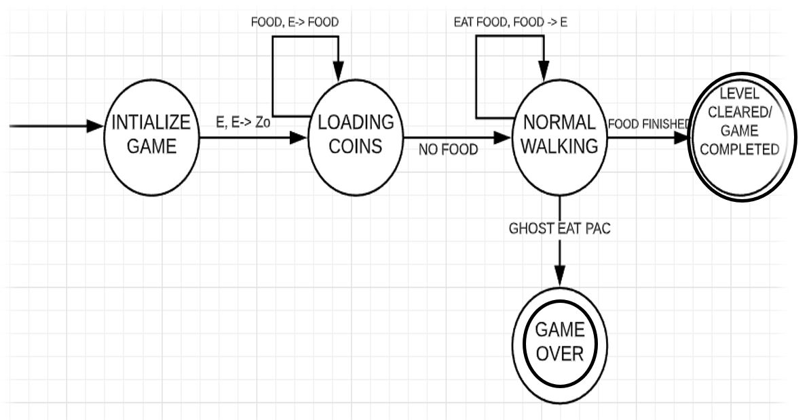
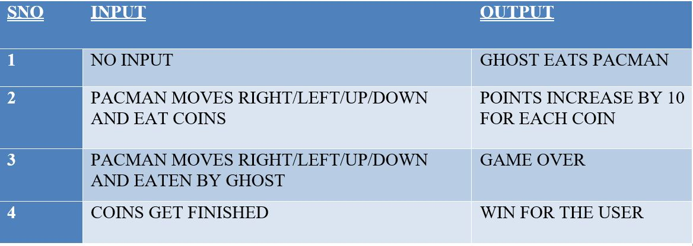
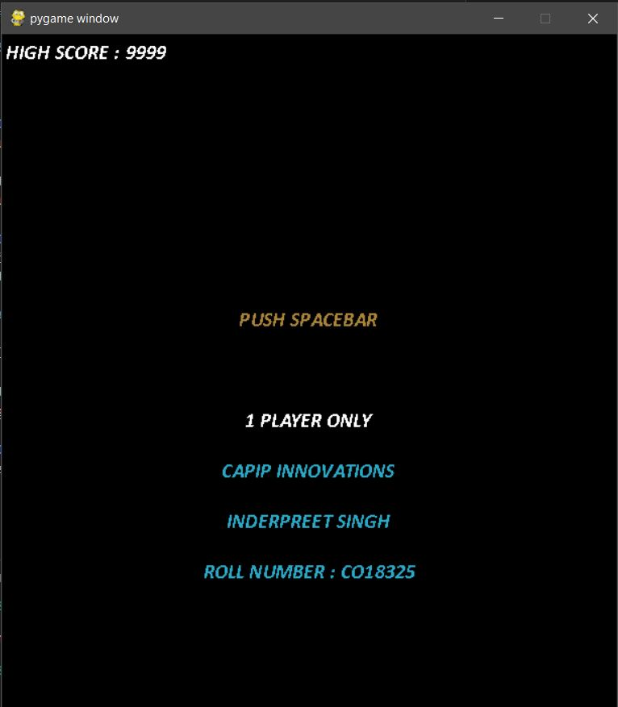
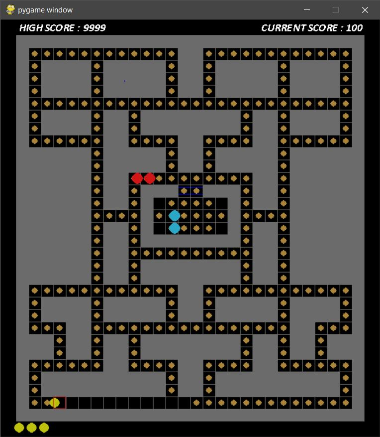
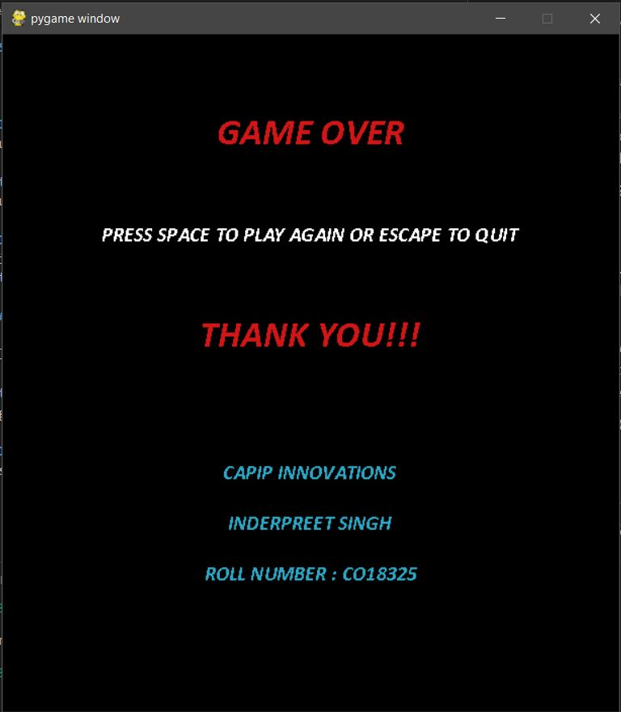

# **PACMAN** 
### INDERPREET SINGH  
#### inderpreet221099@gmail.com
<br>

[](https://www.python.org/downloads/release/python-360/)


<br>

## INSTALLATION PROCESS
```
git clone https://github.com/CO18325/PACMAN---PYGAME.git
pip install pygame
python main.py

```
<br>
<hr>

## INTRODUCTION
<br>
<p>

Pac-Man is a maze arcade game developed and released by **Namco** in 1980. The player or the computer user controls the Pac-Man, who must eat all the coins which are placed inside the game maze while avoiding the Ghost which will try to catch the Pac. Pac-Man is considered as a widespread commercial success, and it has an enduring commercial and cultural legacy. **The game is considered important and influential, and it is commonly listed as one of the greatest video games of all time.**

**Push Down Automate** is used to design the Pacman game by utilizing a finite-state machine with a stack to store the inputs such that the system can memorize. **It is observed that there exists a correlation between the given inputs and the expected outcomes.** Therefore, PDA is considered a helping tool to explain the story and business process of a game. Moreover, PDA extremely helps the coding procedure to be more systematic and organized<br><br>
<center>
<br>
</center>

</p>
<br>

## PACMAN'S BEHAVIOUR

<p>

1.	**INITIATE THE GAME**: This is the beginning of the game, including load the various objects:
    - Maze 
    - Ghost 
    - Default score = 0

2.	**LOADING COIN**: This is the state where all coins are placed inside the maze are loaded. Each coin is of some points. Eating all the coins will make the Pac win the game. 
3.	**NORMAL PACMAN MOVEMENT**: This is the state where Pac enters the maze and eats the coins. The Pac can also move without collecting any coins.
4.	**GAME OVER / PAC DESTROYED**: This is the state where Pac is in the Normal state after being eaten by the ghost. After being eaten for 5 times, then the game is considered finished 
5.	**WINNING STATE**: This is the state where all coins are successfully eaten by Pac.

<br>
</p>

## GHOST’S  BEHAVIOUR


<p>

1.	**INITIALIZE THE GAME**: Load all the Ghosts in the Base Position
2.	**GHOST MOVEMENT**: Ghost movement will be directed towards the Pacman. It means to attack the Pac man i.e. **INTELLIGENT GHOST SYSTEM**
3.	**ENCOUNTERING PAC**: On having the Pacman in the same grid box, eat or destroy it.
4.	**GAME OVER STATE / RESET STATE**: On destroying the Pac, or in case of Pac finishing all the coins i.e. Winning State for Pacman or if the user quits the game, the ghost will return to the base position.

<br>
</p>

## INTELLIGENT GHOST SYSTEM


<p>

**In this application, Ghosts have variable functionality:**
1. **RANDOM MOVEMENT**: These types of ghosts are move randomly in game grid irrespective of the position of the Pac. The algorithm used for this movement is quite simple. Randint function from the random library of python is used in it. For 4 different numbers chosen randomly by this function, corresponds four different direction . And it will keep on searching for the random direction until there is no wall present in the random direction selected
 
2.	**ATTACKING MOVEMENT**: These types of ghosts move specifically towards the Pac. The path of these ghosts is set with the Breadth First Search Algorithm. After each pixel movement, the BFS path is calculated between the source position (i.e. Current Position of the Ghost) and Destination Position (i.e. Current Position of the Pac). And based on this path, the direction of next step of the Ghost is calculated.

<br>
</p>

## WALL SYSTEM


<p>
There is no as such walls that can be identified by the Pac or the Ghosts. So, I have constructed a grid in which different symbols represent different objects:

1. 1 : WALL
2. 0 : FREE WALKING PATH
3. C : COIN IS PLACED
4. P : PACMAN’S STARTING POSITON
5. 2,3,4,5 : GHOSTS STARTING POSITIONS

Thus, it helps to identify the Walls. For every movement in any direction first it is checked, if the pixel position has a 1 in the grid constructed. If 1 is present it is considered as a wall and nothing can pass through the wall.

<br>
</p>


## BLACK BOX TESTING

<br>
<center>

</center>
<br><br>

## GAME PREVIEW

<br>




<br><hr>


